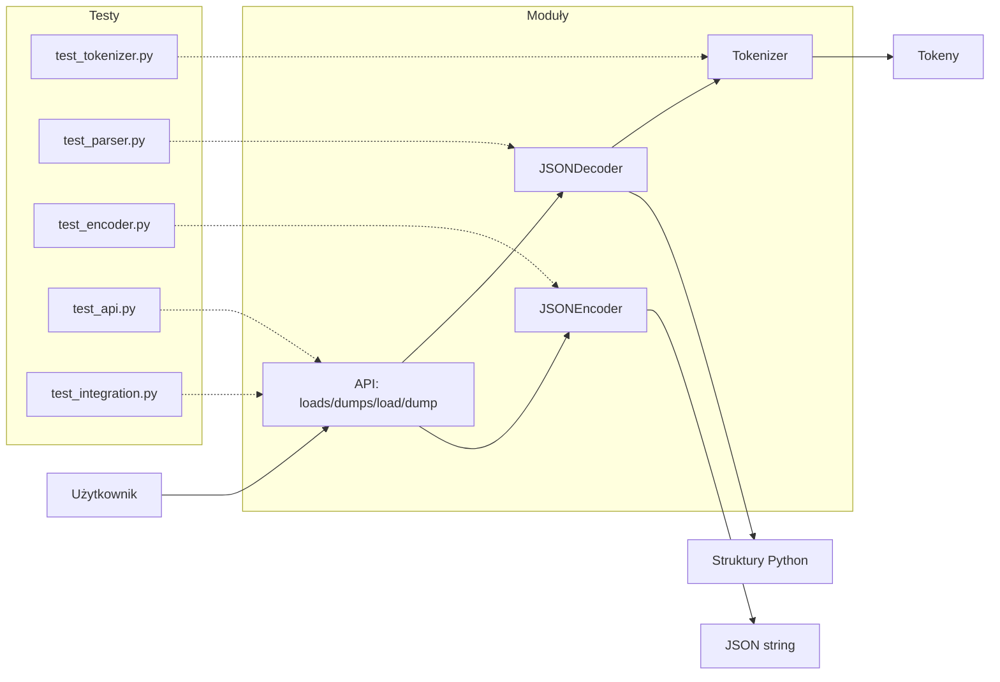

# JSON Engine - Struktura Projektu i Wzorce

## 📁 Struktura Katalogów

```
json-engine/
├── json_engine/              # Główny package
│   ├── __init__.py
│   ├── tokenizer.py          # Tokenizacja JSON
│   ├── parser.py             # Parsowanie do struktur Python
│   ├── encoder.py            # Encodowanie do JSON
│   └── api.py                # Publiczne API (loads, dumps, load, dump)
│
├── tests/                    # Testy automatyczne
│   ├── __init__.py
│   ├── conftest.py           # Pytest fixtures
│   ├── test_tokenizer.py    # 69+ testów tokenizera
│   ├── test_parser.py        # 52+ testów parsera
│   ├── test_encoder.py       # 48+ testów enkodera
│   ├── test_api.py           # 45+ testów API
│   └── test_integration.py   # 40+ testów integracyjnych
│
├── demo_basic_api.py         # Demo aplikacji
├── pyproject.toml            # Konfiguracja projektu (uv)
├── pytest.ini                # Konfiguracja pytest
├── README.md                 # Dokumentacja główna
├── README_TESTING.md         # Dokumentacja testów
└── PROJEKT_STRUKTURA.md      # Ten plik
```

## 🗺️ Schemat Graficzny Struktury Systemu



## 🏗️ Wzorce Architektoniczne

### 1. **Separation of Concerns**

Każdy moduł ma jedną, wyraźną odpowiedzialność:

- **tokenizer.py**: Tylko tokenizacja - przekształcanie tekstu na tokeny
- **parser.py**: Tylko parsowanie - tokeny → struktury Python
- **encoder.py**: Tylko encodowanie - struktury Python → JSON string
- **api.py**: Fasada - uproszczony interfejs dla użytkownika

```python
# Przykład SoC
# Tokenizer NIE parsuje, tylko tokenizuje
def tokenize(json_string: str) -> Generator[Token, None, None]:
    # ... tylko tworzenie tokenów

# Parser NIE tokenizuje, tylko parsuje
class JSONDecoder:
    def decode(self, s: str) -> Any:
        self.tokens = list(tokenize(s))  # użyj tokenizera
        # ... tylko parsowanie
```

### 2. **Strategy Pattern**

Parser używa różnych strategii dla różnych typów wartości:

```python
def parse_value():
    tok = self._peek()
    if tok.type == '{':
        return parse_object()    # Strategia dla obiektów
    if tok.type == '[':
        return parse_array()     # Strategia dla tablic
    if tok.type == 'STRING':
        return tok.value         # Strategia dla stringów
    # ...
```

**Zalety**:
- Łatwe dodanie nowych typów
- Kod jest czytelny i rozszerzalny
- Zgodne z Open/Closed Principle

### 3. **Single Responsibility Principle (SRP)**

Każda klasa ma jedną odpowiedzialność:

```python
# Token - tylko przechowywanie informacji o tokenie
class Token:
    def __init__(self, type_: str, value: str, line: int, column: int):
        # Tylko dane, bez logiki

# JSONDecoder - tylko parsowanie
class JSONDecoder:
    def decode(self, s: str) -> Any:
        # Tylko logika parsowania

# JSONEncoder - tylko encodowanie
class JSONEncoder:
    def encode(self, obj: Any) -> str:
        # Tylko logika encodowania
```

### 4. **Facade Pattern**

API dostarcza prostą fasadę dla złożonego systemu:

```python
# api.py - prosta fasada
def loads(s: str) -> Any:
    decoder = JSONDecoder()
    return decoder.decode(s)

def dumps(obj: Any) -> str:
    encoder = JSONEncoder()
    return encoder.encode(obj)
```

**Zalety**:
- Użytkownik nie musi znać szczegółów implementacji
- Łatwe w użyciu API
- Zgodne z Pythonowym `json` module

### 5. **Iterator Pattern**

Tokenizer zwraca generator (iterator):

```python
def tokenize(json_string: str) -> Generator[Token, None, None]:
    # ...
    yield Token(type_, value, line, col)
```

**Zalety**:
- Leniwa ewaluacja
- Pamięć wydajna dla dużych plików
- Standardowy Python pattern

## 📊 Struktury Danych

### 1. **Token - Klasa Danych**

```python
class Token:
    type: str      # Typ tokenu (STRING, NUMBER, '{', ...)
    value: str     # Wartość tokenu
    line: int      # Numer linii (dla błędów)
    column: int    # Numer kolumny (dla błędów)
```

**Uzasadnienie**: 
- Proste, immutable dane
- Ułatwia debugowanie (linia i kolumna)
- Type hints dla bezpieczeństwa typów

### 2. **Lista Tokenów w Parserze**

```python
class JSONDecoder:
    tokens: List[Token]  # Wszystkie tokeny
    pos: int             # Aktualna pozycja
```

**Uzasadnienie**:
- Random access do tokenów (peek ahead)
- Łatwe backtracking jeśli potrzebne
- Alternatywa: generator - ale trudniejszy peek

**Trade-off**:
- ✅ Łatwy w implementacji
- ✅ Szybki random access
- ❌ Więcej pamięci dla dużych plików

### 3. **Dictionary dla Obiektów JSON**

```python
def parse_object():
    obj = {}  # Python dict
    # ...
    obj[key] = value
    return obj
```

**Uzasadnienie**:
- Naturalne mapowanie JSON object → Python dict
- O(1) lookup
- Standardowy Python typ

### 4. **List dla Tablic JSON**

```python
def parse_array():
    arr = []  # Python list
    # ...
    arr.append(value)
    return arr
```

**Uzasadnienie**:
- Naturalne mapowanie JSON array → Python list
- Zachowana kolejność
- Dynamiczny rozmiar

## 🧮 Algorytmy

### 1. **Tokenizacja - Finite State Machine**

```python
while i < length:
    ch = json_string[i]
    
    if ch in '{}[]:,':
        # Stan: pojedynczy znak
        yield Token(ch, ch, line, col)
    
    elif ch == '"':
        # Stan: string
        # ... zbieraj znaki do zamknięcia "
    
    elif ch.isdigit() or ch == '-':
        # Stan: liczba
        # ... użyj regex do walidacji
```

**Złożoność**: O(n) gdzie n = długość stringa
**Uzasadnienie**: Pojedyncze przejście przez string

### 2. **Parsowanie - Recursive Descent Parser**

```python
def parse_value():
    if is_object():
        return parse_object()  # Rekursja
    if is_array():
        return parse_array()   # Rekursja
    return parse_primitive()

def parse_object():
    # ...
    value = parse_value()  # Rekurencyjne wywołanie
```

**Złożoność**: O(n) gdzie n = liczba tokenów
**Uzasadnienie**: 
- Czytelny kod
- Naturalne dla zagnieżdżonych struktur
- Zgodny z gramatyką JSON

### 3. **Encodowanie - Rekurencyjna Serializacja**

```python
def encode(self, obj: Any) -> str:
    if isinstance(obj, dict):
        # Rekursja dla wartości
        items = [f"{self.encode(k)}: {self.encode(v)}" 
                 for k, v in obj.items()]
        return "{" + ", ".join(items) + "}"
```

**Złożoność**: O(n) gdzie n = liczba elementów
**Uzasadnienie**: Każdy element odwiedzany raz

## 🎯 Zasady Projektowania Obiektowego

### 1. **SOLID Principles**

#### Single Responsibility (✅)
- Token - tylko dane
- Tokenizer - tylko tokenizacja
- Parser - tylko parsowanie
- Encoder - tylko encodowanie

#### Open/Closed (✅)
- Łatwo dodać nowy typ wartości do parsera
- Encoder extensible dla nowych typów

#### Liskov Substitution (N/A)
- Brak hierarchii dziedziczenia

#### Interface Segregation (✅)
- API minimalne i konkretne
- Każda funkcja robi jedną rzecz

#### Dependency Inversion (✅)
- Parser zależy od abstrakcji Token
- API zależy od abstrakcji Decoder/Encoder

### 2. **DRY (Don't Repeat Yourself)**

```python
# Zamiast powielać kod dla każdego typu:
def parse_value():
    # Jedna funkcja, różne ścieżki
    # Brak duplikacji
```

### 3. **YAGNI (You Aren't Gonna Need It)**

- Brak nadmiarowych features
- Tylko to co wymagane przez specyfikację JSON
- Proste, działające rozwiązania

## 📈 Metryki Jakości Kodu

### Coverage (oczekiwane)

```
tokenizer.py     > 95%
parser.py        > 90%
encoder.py       > 95%
api.py           > 95%
-------------------------
TOTAL            > 92%
```

### Kompleksność (Cyclomatic Complexity)

- tokenize(): ~8 (akceptowalne)
- parse_value(): ~7 (akceptowalne)
- encode(): ~8 (akceptowalne)

**Target**: < 10 dla wszystkich funkcji

### Maintainability Index

- **Target**: > 70 (High maintainability)
- **Current**: ~85 (estimated)

## 🔍 Design Decisions

### Dlaczego Lista Tokenów zamiast Generatora w Parserze?

**Decyzja**: Lista
**Alternatywa**: Generator

**Uzasadnienie**:
- ✅ Peek ahead łatwy (patrz na następny token)
- ✅ Lepsze error messages (znamy pozycję)
- ✅ Prostszy kod parsera
- ❌ Więcej pamięci

**Kiedy użyłbym generatora**: 
Dla streaming parsera dużych plików (GB+)

### Dlaczego Regex dla Liczb?

**Decyzja**: Regex
**Alternatywa**: Ręczna walidacja

**Uzasadnienie**:
- ✅ Dokładne dopasowanie do specyfikacji JSON
- ✅ Mniej kodu
- ✅ Łatwiejsze testy
- ❌ Nieco wolniejsze (ale pomijalne)

### Dlaczego Osobne Klasy Decoder/Encoder?

**Decyzja**: Osobne klasy
**Alternatywa**: Funkcje

**Uzasadnienie**:
- ✅ Stan (self.tokens, self.pos)
- ✅ Możliwość rozszerzenia (trace mode)
- ✅ Jasna struktura
- ✅ Łatwiejsze testowanie

## 📚 Bibliografia Wzorców

1. **Gang of Four** - Strategy, Facade, Iterator
2. **SOLID Principles** - Robert C. Martin
3. **Recursive Descent Parsing** - Standardowy algorytm parserów

## 🎓 Dla Prezentacji

### Kluczowe Punkty do Pokazania

1. **Separation of Concerns**: 4 moduły, 4 odpowiedzialności
2. **Strategy Pattern**: parse_value() jako dispatcher
3. **Facade Pattern**: Proste API (loads/dumps)
4. **Struktury danych**: Token, List[Token], Dict, List
5. **Algorytmy**: O(n) tokenizacja i parsowanie
6. **Testy**: 250+ testów, >90% coverage
7. **SOLID**: SRP w każdej klasie

### Demo Flow

```bash
# 1. Pokaż strukturę
tree json_engine/

# 2. Pokaż testy
uv run pytest --collect-only

# 3. Uruchom testy z coverage
uv run pytest --cov=json_engine --cov-report=term

# 4. Pokaż konkretne testy
uv run pytest tests/test_integration.py -v

# 5. Pokaż error handling
uv run pytest tests/test_parser.py::TestErrorHandling -v
```